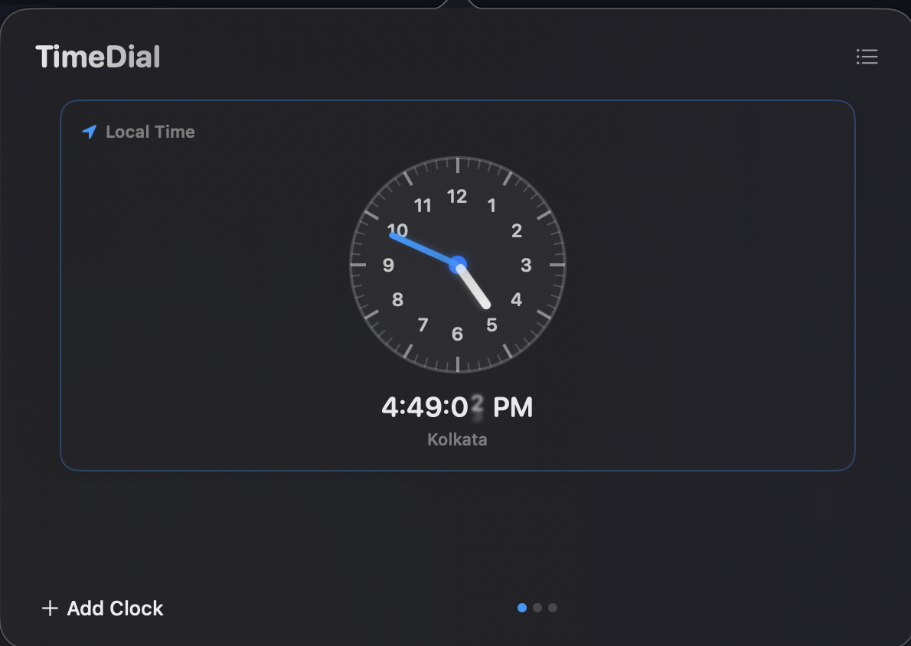
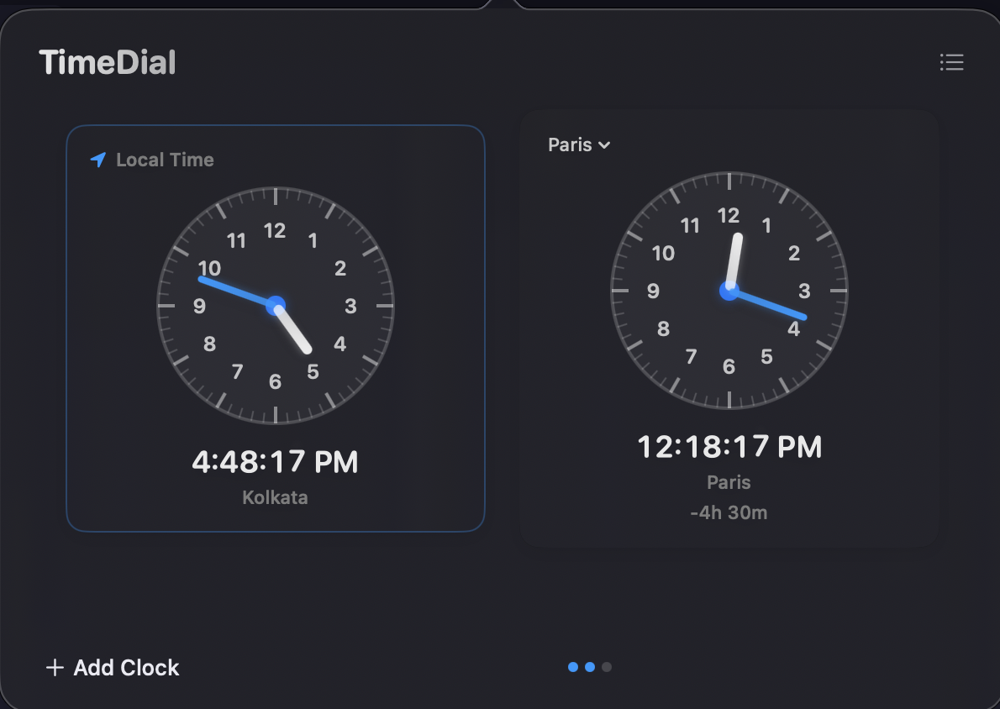
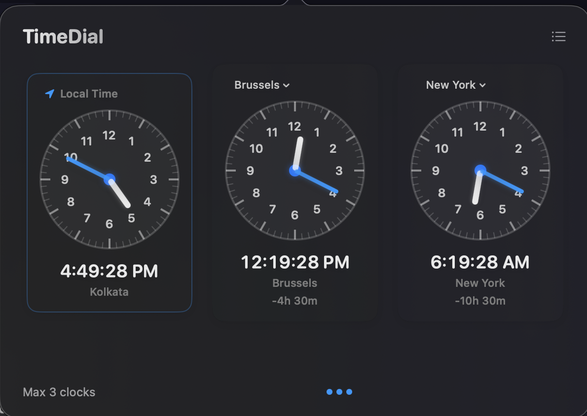
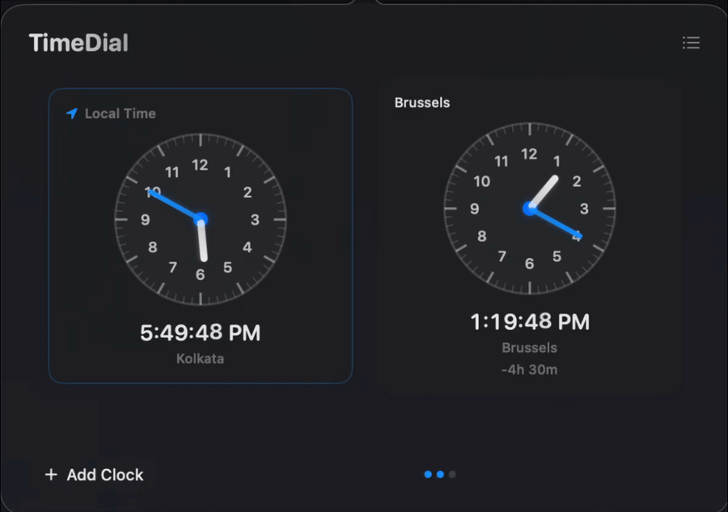

# TimeDial

A lightweight macOS menu bar app for comparing timezones with beautiful, interactive analog clocks.



## ✨ Features

- **🌍 Multiple Timezone Clocks** - Compare up to 3 different timezones at once (1 local + 2 additional)
- **🖱️ Interactive Time Adjustment** - Drag any clock's hour or minute hand to set time manually
- **⚡ Real-time Sync** - All clocks update instantly when you adjust any clock
- **🎨 Beautiful Analog Design** - Clean, modern clock faces with smooth animations
- **🔍 Smart Timezone Search** - Quick timezone picker with favorites and common abbreviations (PST, EST, GMT, etc.)
- **💾 Persistent State** - Your clocks and preferences are saved automatically
- **🎯 Menu Bar Only** - Lightweight app that lives in your menu bar (no Dock icon)
- **📐 Compact Mode** - Toggle between full and compact view

## 📸 Screenshots

<div align="center">


*Interactive clock interface with timezone search*


*Drag clock hands to adjust time across all timezones*

</div>

## 🎥 Demo



## 🎮 How to Use

1. **Click the clock icon** in your menu bar to open TimeDial
2. **Drag clock hands** to manually set time - all other clocks update in real-time
3. **Add clocks** using the "+ Add Clock" button (supports up to 2 additional timezones)
4. **Search timezones** by city name or abbreviation (e.g., "PST", "Tokyo", "London")
5. **Toggle compact view** using the button in the top-right corner
6. **Reset to current time** by clicking the "Reset All" button (appears when in manual mode)

## 💻 Requirements

- macOS 13.0 or later
- Xcode 15+ (for building from source)

## 🚀 Installation

### Option 1: Download Release
1. Download the latest `.zip` from [Releases](../../releases)
2. Unzip and drag `TimeDial.app` to your Applications folder
3. Right-click → Open (first time only, to bypass Gatekeeper)

### Option 2: Build from Source

1. Clone the repository
```bash
git clone https://github.com/yourusername/timedial.git
cd timedial
```

2. Open in Xcode
```bash
open timedial.xcodeproj
```

3. Build and run
- Select the `timedial` scheme
- Press `⌘R` or Product → Run

The app will appear as a clock icon in your menu bar.

## 🔧 Configuration

### Menu Bar Visibility
If the icon is hidden, enable it in:
**System Settings → Menu Bar → Allow in Menu Bar → TimeDial** (toggle on)

### Launch at Login
To start automatically on login:
**System Settings → Login Items & Extensions** → add TimeDial

### Performance & Memory
- Idle memory around 70–90 MB is expected.
- While interacting (opening the timezone list, scrolling, searching), memory may temporarily rise to ~200 MB and then settle after closing.
- If memory keeps growing while idle, check for duplicate app installs and report an issue.

## 📦 Creating a Release Build

Use the included packaging script to create a distributable `.zip`:

```bash
chmod +x package_zip.sh
./package_zip.sh
```

The archive will be created in `dist/TimeDial-{version}.zip` and can be attached to a GitHub Release.

### Gatekeeper Note
Unsigned apps will show a security warning on first launch. Users can:
- Right-click → Open, or
- Allow it in **System Settings → Privacy & Security**
If macOS shows “app is damaged and can’t be opened”, run:
```bash
xattr -dr com.apple.quarantine /Applications/TimeDial.app
```

## 🧰 Troubleshooting
- **Menu bar icon missing**: Enable it via **System Settings → Menu Bar → Allow in Menu Bar → TimeDial**.
- **App won’t open after download**: Use Right-click → Open once to clear Gatekeeper.
- **Wrong app launches** (dev machines): Remove older DerivedData builds and reinstall from `/Applications`.

## 🏗️ Architecture

- **SwiftUI** for the entire UI
- **AppKit** NSStatusBar for menu bar integration
- **Combine** for reactive state management
- **UserDefaults** for persistent storage

## 📝 License

MIT License - feel free to use and modify!

## 🤝 Contributing

Contributions are welcome! Feel free to open issues or submit pull requests.

---

Made with ❤️ for timezone travelers
